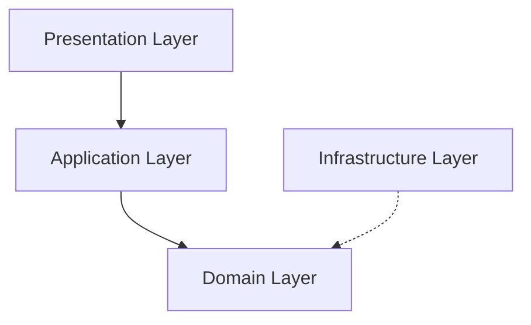

# AvatarSystemDemo

## 概要

Unityでアバターシステムを実装するデモ

- アバターとしてUnityちゃんを利用
- Firebaseによるバックエンド連携
- ビルドターゲットはAndroidを想定

https://github.com/user-attachments/assets/3098394c-4a4c-4f3a-89c3-af8c72af6c18

## 機能

## 実装済み

- ログインページ
  - ユーザの認証や登録
- アバターシステムページ
  - 体型の変更
  - 肌、髪の色の変更
  - UIの表示・非表示
  - カメラの回転、高さ調整、ズーム
  - ローカル/サーバへのデータ保存

## 未実装

- アバターシステムページ
  - 目の色の変更

- ルームページ
  - ルーム制作
  - アバター操作

## 既知の不具合

- 体型を変更すると親から子に値が伝播するため、回転に応じて歪みが発生する
  - セグメントスケール補正が必要

## アーキテクチャ

VcotainerによるDI、R3によるリアクティブプログラミングなどを組み合わせて、関心の分離を実践

### Domain層

- 目的
  - ゲームのルールやロジックを中心に据えたビジネスロジックを実装
- 依存関係
  - どこにも依存しない（UniRxやUniTaskへの依存は許可）
- 構成要素
  - Interfaces：Domain ServiceおよびInfrastructure層のインタフェースを定義
  - ValueObject：Domain Modelを実装
  - Entities：Domain Modelを実装

### Application層

- 目的
  - Domain層のロジックを活用し、ユースケースごとの処理をまとめる
- 依存関係
  - Domain層に依存
- 構成要素
  - UseCases：ServiceやRepositoryを利用してUseCaseを実装
  - DTO：Presentation層にDomain層のデータを渡すためのDTOを実装

### Infrastructure層

- 目的
  - 外部データソースや永続化の管理
- 依存関係
  - Domain層に依存
- 構成要素
  - Repositories：リポジトリを実装
  - Services：外部APIなどを利用してサービスを実装

### Presentation層

- 目的
  - UI操作やゲームの見た目を管理
- 依存関係
  - Domain層やUseCase層に依存（注意：Domain層への依存は要修正）
- 構成要素
  - Presenter：MVPパターンにおけるPresenterを実装
  - View：MVPパターンにおけるViewを実装
  - Utils：ユーティリティを実装
  - ScriptableObjects：固有のパラメータなどを定義

## セットアップ / 実行方法

1. リポジトリのクローン

2. Unityで開く

## 依存関係

### Unity

- Unity 6.000.0.29f1以降

### Firebase Unity SDK

- 12.6.0以上

### Unity Chan

- このリポジトリには Unity Chan アセットが含まれています
- アセットの再配布は Unity-Chan License Terms に基づいて行われています
- ライセンスの詳細は `Assets/UnityChan/License` フォルダ内のファイル、または[公式ウェブサイト](https://unity-chan.com/contents/guideline_en/) を参照してください
- © Unity Technologies Japan/UCL

### その他

- VContainer
- R3
- UniTask

## 注意事項

- `google-services.json` / `GoogleService-Info.plist`は機密情報を含むため、リポジトリには含まれていない
- 各自でFirebaseプロジェクトを作成し、設定ファイルを取得、配置すること

## ライセンス

- 同梱されているUnity Chanアセットのライセンスについては公式サイトを確認すること
- 同梱されいるFirebase Unity SDKのライセンスについては公式サイトを確認すること
